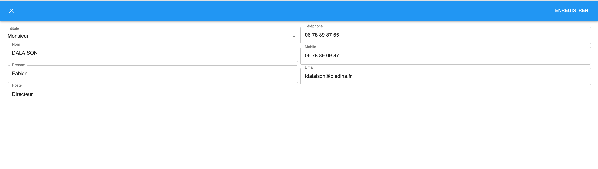

  

#### Présentation de mon propre CRM développé avec Typescript et React JS

 

##### Technologies utilisées

- Typescript
- React JS
- Express
- mongoDB
- MaterialUI

 

##### Fonctionnalités

 

- Entreprise

  - Vue de toutes les entreprises réparties par Client ou Prospect avec les informations principales
  - Faire une recherche sur le nom, la ville ou le code postal de l'entreprise
  - Possibilité d'ajouter une entreprise et de la supprimer
  - Vue complète d'une entreprise sélectionnée et possibilité de modifier les informations
      
    
      

- Contacts

  - Vue de tous les contacts dans une entreprise selectionnée
  - Possibilité d'ajout et suppression d'un contact
  - Vue d'un contact selectionné et possibilité de modifier les informations
      
    
      

- Commentaires sur l'entreprise
  - Vue de tous les commentaires triés par date et possibilité d'associer un contact de l'entreprise
  - Possibilité d'ajout et de suppression d'un commentaire
      
    
      

 

##### Futurs ajouts de fonctionnalités

 

Encore en développement, je souhaite ajouter les fonctionnalités suivantes :

- ajouter et de générer des factures en PDF
- avoir un suivi mois par mois de son chiffre d'affaires et des factures
- un dashboard basé sur D3.js pour avoir un vue globale de l'activité
