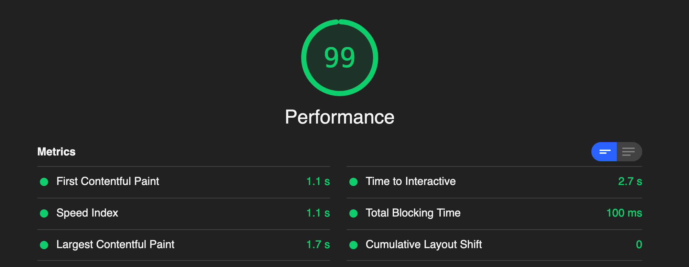

  

#### Présentation de mon site internet nicolasmaret.fr

 

##### Technologies utilisées

- Javascript
- React JS
- Gatsby
- Strapi
- MongoDB
- Bootstrap

 

##### Fonctionnalités

 

- Admin

  - Ajout d'un blog en markdown interfacé avec Strapi
  - Possibilité d'ajouter des projets au fur et à mesure
  - Synchronisation automatique entre GitHub et Netlify grace aux Webhooks

* Visiteur

  - Connaissance de mon parcours et de mes compétences
  - Vue en détail de mes projets réalisés
  - Lecture de mes articles de blog
  - Possibilité de me contacter via un formulaire

 

- Performances

  - Chargement rapide des pages
  - Référencement via les plugins SEO et Helmet de Gatsby
  - Site entièrement responsive

 

- Lighthouse

