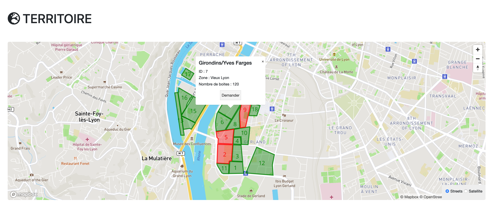
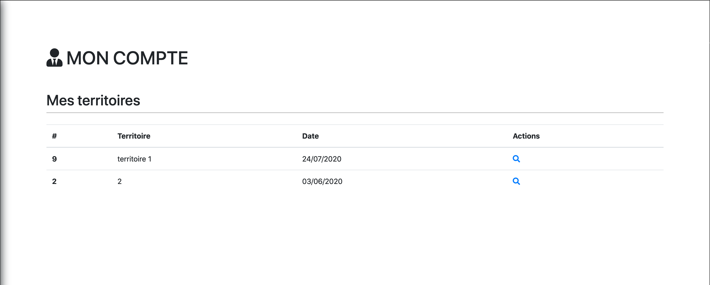
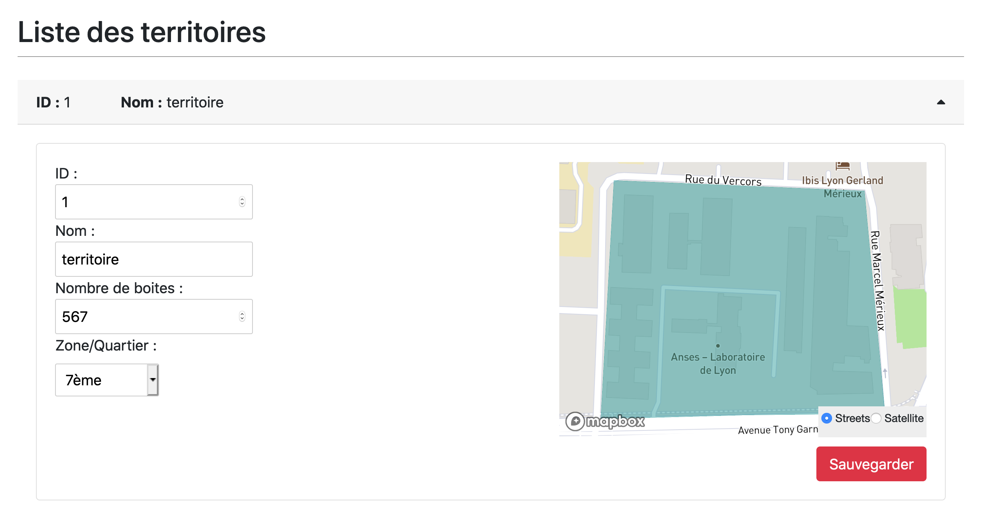
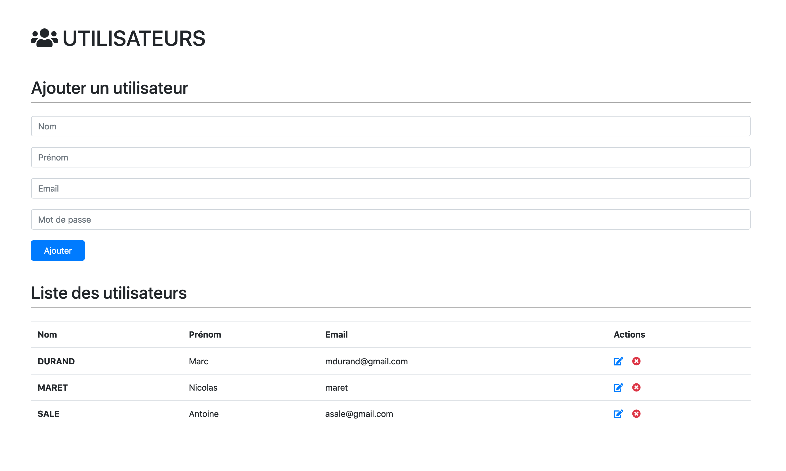

  

#### Présentation de mon application de gestion de territoires avec MapBox et Svelte

 

##### Technologies utilisées

- Javascript
- Svelte JS
- Express
- MongoDB
- Bootstrap
- Mapbox
- Authentification avec JWT tokens

 

##### Fonctionnalités

 

- Admin

  - import d'un fichier GeoJSON pour créer la base de données. Supprimer entièrement la base
  - ajout suppression modification des informations des territoires (nom, quartier, etc...)
  - Vision globale de la carte avec les territoires attribués ou non
  - Possibilité d'attribuer le territoire demandé par un utilisateur directement ou proposer un autre
  - Ajout/suppression/modification des utilisateurs

 

- Utilisateur
  - Vue de l'ensemble des territoires attribués
  - Vue en détail d'un territoire avec la possibilité de l'imprimer
  - Modification des informations personnelles

 

##### Screenshots

 

- Vue d'ensemble du territoire avec Mapbox et les polygones dessinés
  

 

- Accueil d'un utilisateur avec ses territoires alloués

  

 

- Vue détaillée d'un territoire en tant qu'admin avec modifications possibles

  

 

- Gestion des utilisateurs en tant qu'admin
  
